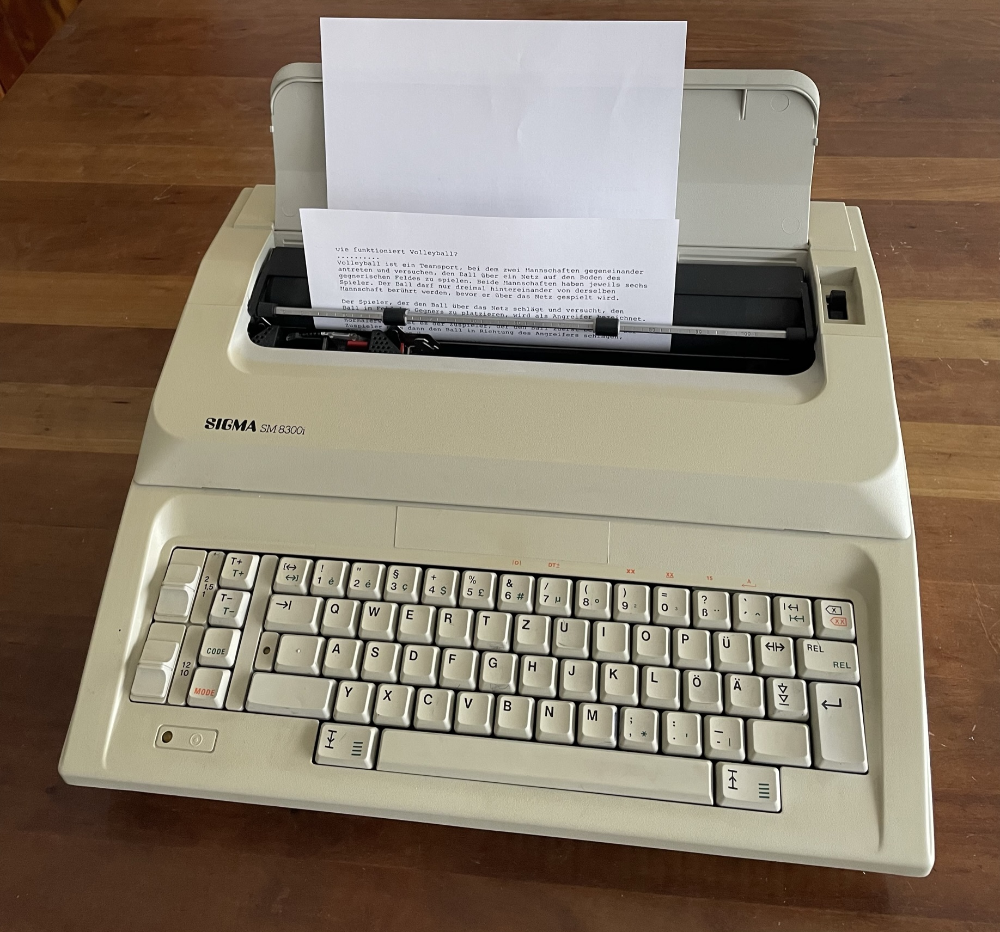

Maker Media GmbH

***

# KI auf der Schreibmaschine

Eine angestaubte DDR-Typenradschreibmaschine aus den 1980er Jahren bekommt einen ESP32 eingebaut, der ChatGPT anzapft – so entsteht ein Chatbot der neuesten Generation mit viel Retro-Charme.

Hier gibt es einerseits den Code für den ersten testweisen ChatGPT-Zugriff vom ESP32 aus (im Ordner _testchat_) sowie den kompletten Code für das Projekt _Erika3004_ (im gleichnamigen Ordner).

Für den Betrieb der Schreibmaschine als Chatbot wird noch benötigt: 

- [Bibliothek SoftwareSerial](https://github.com/plerup/espsoftwareserial)

Den Erfahrungsbericht von Daniel Springwald beim Nachbau des Projekts gibt es in seinem [Blog](https://daniel.springwald.de/post/2023/ChatGPT-Schreibmaschine) zu lesen.

Der vollständige Artikel zum Projekt erscheint in der **[Make-Ausgabe 2/23 auf Seite 28](https://www.heise.de/select/make/2023/2/2305908191709481329)** und auf **[heise+](https://heise.de/-7545547)**.
